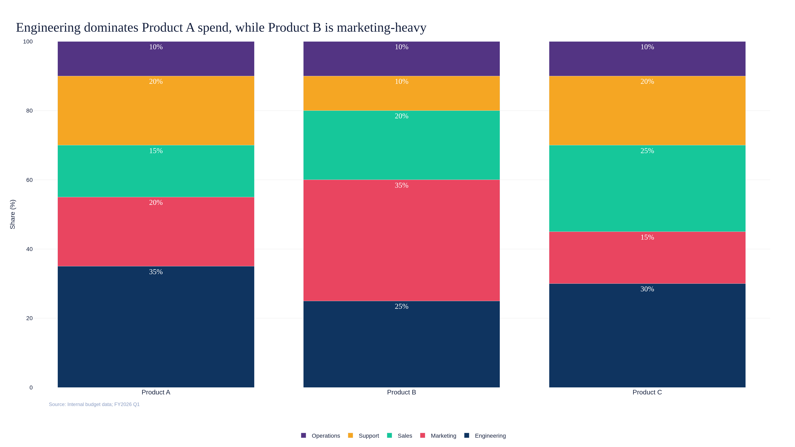
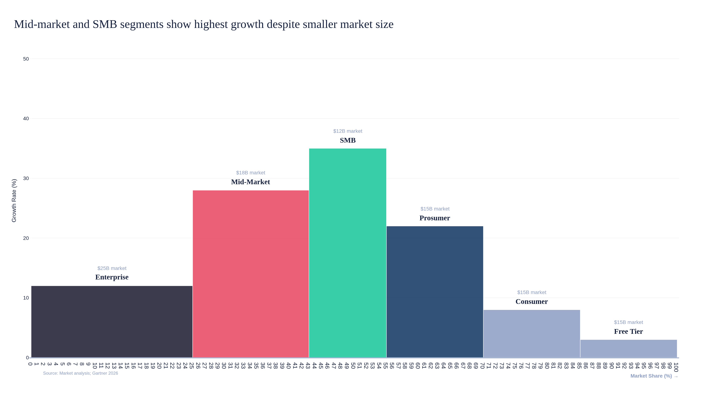
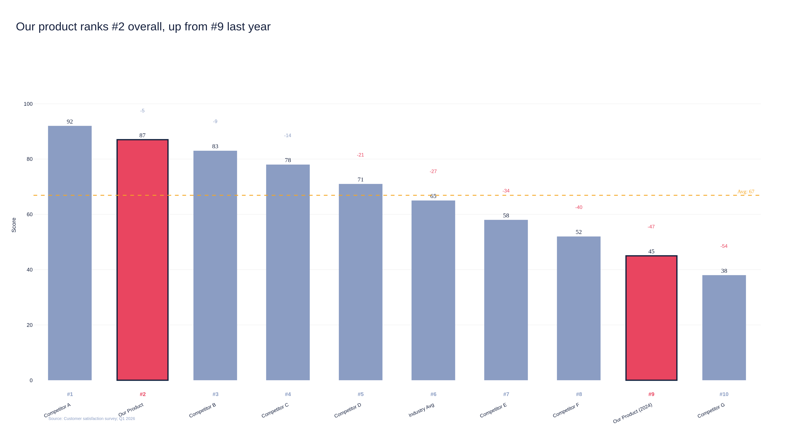
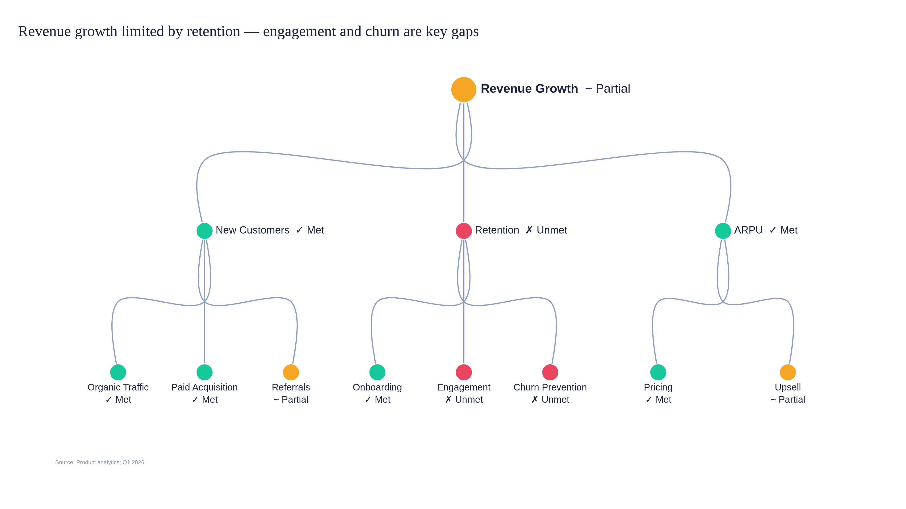
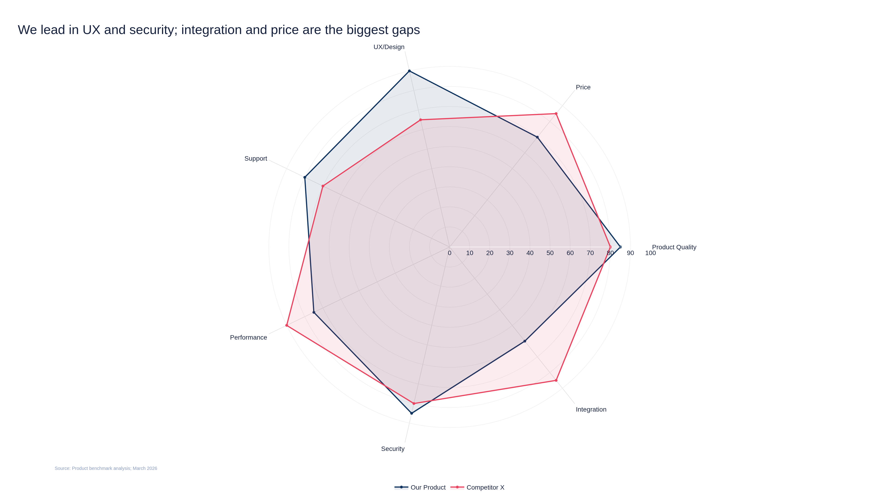
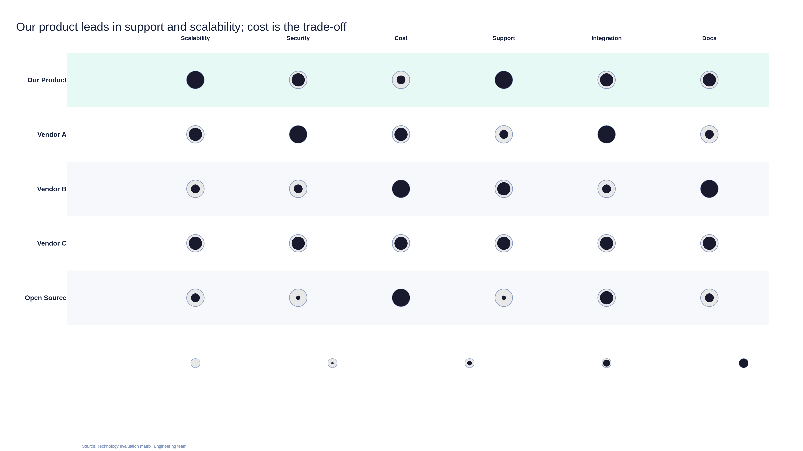
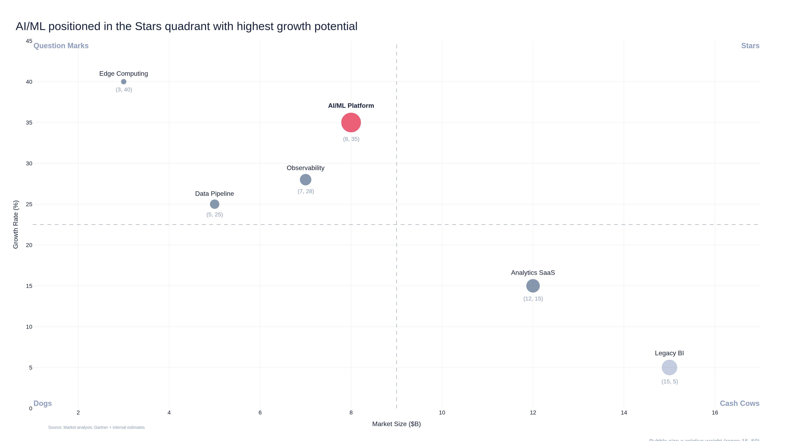
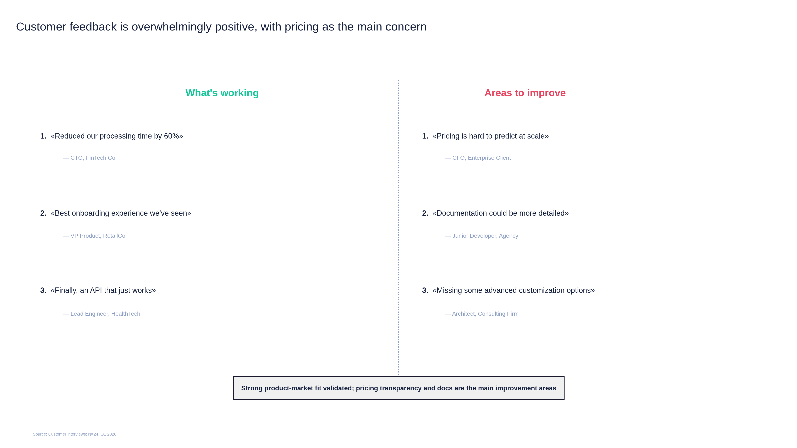
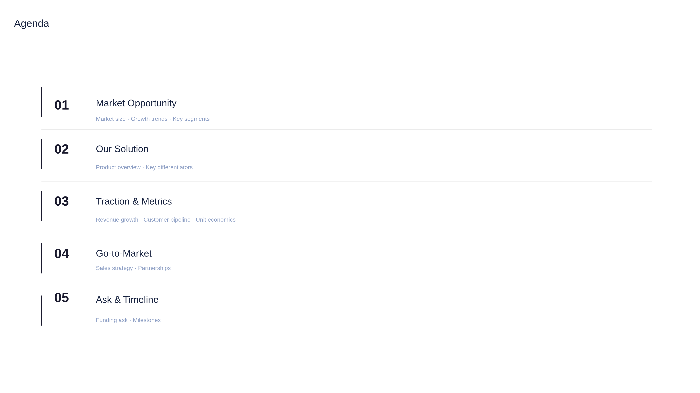
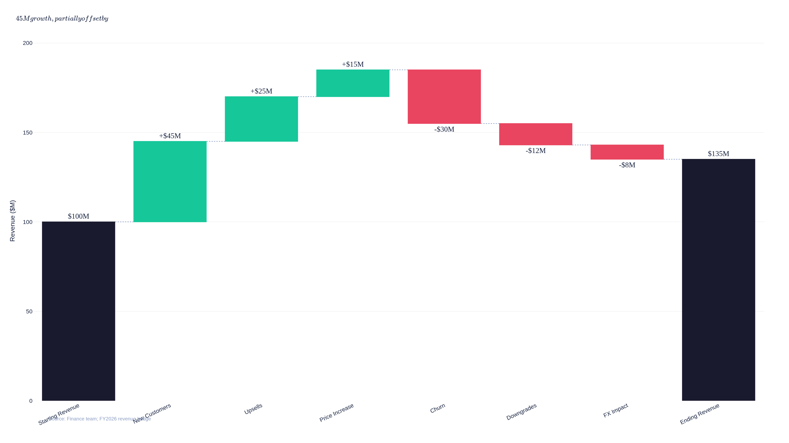

# Consulting Deck Plugin

Claude Code plugin for building premium consulting-style presentations. 10 chart templates with structured discovery workflow (SCR framework, Minto pyramid, horizontal logic). Two-stage rendering: Plotly generates data-accurate drafts, Nano Banana MCP styles them into presentation-ready slides.

## Installation

```bash
claude plugin marketplace add d1bevz/consulting-deck-plugin
claude plugin install consulting-deck@consulting-deck
```

## Skills

| Skill | Purpose | Trigger |
|-------|---------|---------|
| `consulting-deck` | Full presentation pipeline: discovery, structure, slide generation, assembly | "make a presentation", "pitch deck", "consulting deck" |
| `slide-templates` | Individual chart templates for single slides | "make a spider chart", "stacked bar for X" |
| `deck-assembly` | Combine approved slide PNGs into PDF/PPTX | "assemble deck", "export slides", "make PDF" |

## 10 Chart Templates

### 1. Stacked Bar -- Share-of-X Analysis
Compare composition/structure across multiple objects.



### 2. Mekko Chart -- Variable-Width Bars
Two dimensions per bar: width encodes one metric, height encodes another.



### 3. Ranked Bars -- Competitive Ranking
Position an object among competitors in descending order with rank numbers and average line.



### 4. Driver Tree -- KPI Decomposition
Decompose a complex metric into components with status assessment (met/unmet/partial).



### 5. Spider / Radar -- Multi-dimensional Comparison
Compare 2+ profiles across multiple dimensions with gap highlighting.



### 6. Harvey Ball Matrix -- Qualitative Scoring
Score multiple objects against qualitative criteria using proportional circle fills.



### 7. Bubble / 2x2 Matrix -- Strategic Positioning
Position objects on two key parameters with bubble size as third dimension. Quadrant labels included.



### 8. Stakeholder Quotes -- Voice of Customer
Structured pro/contra quotes with attribution and summary synthesis.



### 9. Agenda -- Navigation
Table of contents with numbered sections, subsections, and optional highlight.



### 10. Waterfall Flow -- Cumulative Contributions
Shows how individual positive/negative factors contribute to a final result. Revenue bridges, P&L, factor influence analysis.



## How It Works

### Full Deck (Entry Point A)

The `consulting-deck` skill orchestrates the full process:

1. **Discovery** -- structured interview (audience, SCR, data, arguments)
2. **Structure** -- Minto pyramid (main message + 3-4 MECE arguments)
3. **Horizontal Logic** -- title chain review (titles must tell a story)
4. **Template Selection** -- match each slide purpose to a chart type
5. **Slide Generation** -- for each slide:
   - Plotly script generates data-accurate draft PNG
   - Draft sent to Nano Banana MCP as visual reference
   - Nano Banana generates premium-styled slide
   - User reviews and approves
6. **Assembly** -- combine approved slides into PDF/PPTX

### Single Slide (Entry Point B)

Ask for any template directly:
> "Make a spider chart comparing Product A vs Product B across 7 dimensions"

### Assembly Only (Entry Point C)

> "Assemble all slides into a PDF"

## Rendering Pipeline

```
User Data --> Plotly Script --> Draft PNG --> Nano Banana MCP --> Styled Slide --> PDF/PPTX
                (accurate)                    (premium look)
```

Each chart script:
- Accepts data as Python dict / JSON
- Loads theme from `themes/default.yaml`
- Generates 1920x1080 PNG via Plotly + Kaleido
- Serves as visual reference for Nano Banana prompt

## Presentation Principles (Built-in)

Based on EY consulting presentation methodology:

- **SCR Framework**: Situation -> Complication -> Resolution
- **Minto Pyramid**: Main message + 3-4 MECE arguments
- **Horizontal Logic**: Slide titles read as a coherent narrative
- **Vertical Logic**: One slide = one message
- **Three Perception Levels**: 5 sec (title) -> 15 sec (layout) -> 2 min (details)
- **Talking Titles**: Every title is a conclusion, not a description

## Theme Customization

Edit `themes/default.yaml` to customize colors, typography, and style:

```yaml
name: "Premium Startup"
colors:
  primary: "#1a1a2e"
  accent: "#e94560"
  success: "#16c79a"
  danger: "#e94560"
  chart_palette:
    - "#0f3460"
    - "#e94560"
    - "#16c79a"
    - "#f5a623"
    ...
```

## Dependencies

- Python 3.11+
- plotly + kaleido (chart generation)
- reportlab (PDF assembly)
- python-pptx (PPTX assembly)
- pyyaml (theme loading)
- Nano Banana MCP (image styling)

## Running Scripts Directly

```bash
cd /path/to/consulting-deck-plugin
uv sync
uv run python -m scripts.charts.spider_radar --output output/my_chart.png
uv run python -m scripts.charts.bubble_matrix --data '{"x_axis":"Risk","y_axis":"Impact","items":[...]}' --output output/risk_matrix.png
```

## Tests

```bash
uv run pytest tests/ -v
```

44 tests covering all 10 templates, assembly, utilities, and theme loading.
